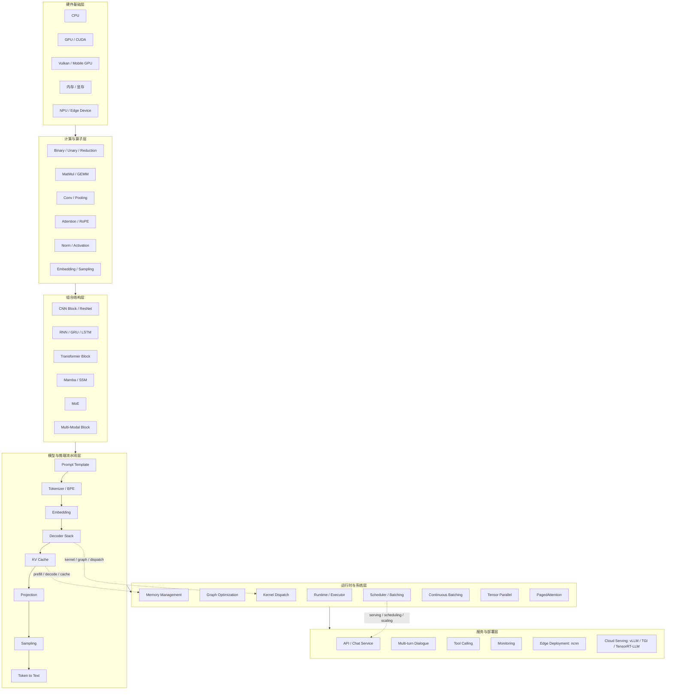
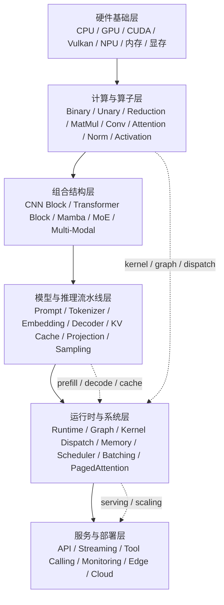

# AI Infra 系统级学习笔记（完整版）

# AI Infra 系统级学习笔记：从深度学习算子到大模型推理系统

> 本项目把原有两份学习资料升级为一套 **AI Infra / LLM Inference / 推理系统工程** 学习项目。  
> 目标不是单纯背概念，而是建立一条完整主线：**算子 → 计算图 → Runtime → KV Cache → Scheduler → Serving → 部署优化**。

---

## 0. 项目定位

这是一套面向以下目标的系统级学习资料：

- 想从深度学习算法转向 **AI Infra / 推理工程 / 大模型部署**；
- 已经了解 CNN、Transformer、LLM 基本结构，但希望理解推理系统为什么快、为什么省显存；
- 想把 `ncnn_llm`、`vLLM`、`TensorRT-LLM`、`TGI` 这类项目串成一条学习主线；
- 想形成可写进简历、可用于面试复盘、可持续更新的 GitHub 学习项目。

原始资料已经具备两个强基础：

1. **算子与架构基础**：包括 Binary/Unary/Reduction、MatMul/GEMM、Conv、Attention、RoPE、Norm、Activation、量化、图优化、部署、模型压缩等；
2. **ncnn_llm 推理链路**：包括 Prompt Template、Tokenizer/BPE、RoPE、Embedding、Decoder、Projection、Sampling、KV Cache、Prefill/Decode、INT8、Vulkan、FlashAttention、Tool Calling、Vision 多模态等。

本项目在此基础上补上 AI Infra 最关键的三条系统主线：

```text
Memory System      : KV Cache、PagedAttention、显存碎片、Cache 复用、KV 量化
Execution System   : Runtime、Graph、Kernel Dispatch、Prefill/Decode、Continuous Batching
Serving System     : Request Queue、Scheduler、Streaming、API、Monitoring、Autoscaling
```

---

## 1. 总体架构



这张图对应本项目的学习方式：先从你已有的 **深度学习算子表** 出发，理解模型是如何计算的；再沿着 `ncnn_llm` 的推理流水线理解 LLM 如何生成；最后补齐服务端推理系统最核心的内存、调度、批处理与部署优化。

---

## 2. 推荐阅读顺序

| 阶段 | 文档 | 目标 |
|---|---|---|
| 0 | [00_overview.md](docs/00_overview.md) | 明确你的当前基础、升级方向和学习地图 |
| 1 | [01_system_architecture.md](docs/01_system_architecture.md) | 建立 AI Infra 六层架构图 |
| 2 | [02_compute_operator_layer.md](docs/02_compute_operator_layer.md) | 把算子理解升级成计算系统理解 |
| 3 | [03_llm_inference_pipeline.md](docs/03_llm_inference_pipeline.md) | 理解 LLM 推理全链路：文本到 token，再到 token |
| 4 | [04_memory_kv_cache.md](docs/04_memory_kv_cache.md) | 深入 KV Cache、显存占用、PagedAttention、KV 量化 |
| 5 | [05_execution_scheduler.md](docs/05_execution_scheduler.md) | 补齐 Scheduler、Batching、Prefill/Decode 调度 |
| 6 | [06_quantization_optimization.md](docs/06_quantization_optimization.md) | 理解 INT8/FP8/INT4、FlashAttention、profiling |
| 7 | [07_ncnn_to_vllm_comparison.md](docs/07_ncnn_to_vllm_comparison.md) | 从 ncnn 端侧推理过渡到 vLLM 服务端推理 |
| 8 | [08_project_and_resume.md](docs/08_project_and_resume.md) | 把学习内容包装成 GitHub 项目、简历项目和面试素材 |
| 9 | [09_learning_plan.md](docs/09_learning_plan.md) | 按 6 周学习计划推进 |
| 10 | [10_glossary.md](docs/10_glossary.md) | 术语速查 |

---

## 3. 项目目录

```text
AI_Infra_System_Notes/
├── README.md
├── CHECKLIST.md
├── docs/
│   ├── 00_overview.md
│   ├── 01_system_architecture.md
│   ├── 02_compute_operator_layer.md
│   ├── 03_llm_inference_pipeline.md
│   ├── 04_memory_kv_cache.md
│   ├── 05_execution_scheduler.md
│   ├── 06_quantization_optimization.md
│   ├── 07_ncnn_to_vllm_comparison.md
│   ├── 08_project_and_resume.md
│   ├── 09_learning_plan.md
│   └── 10_glossary.md
├── diagrams/
│   └── ai_infra_architecture.mmd
├── assets/
│   └── ai_infra_architecture.svg
└── source/
    ├── deep_learning_operators_original.md
    └── ncnn_llm_original_README.md
```

---

## 4. 一句话主线

> **AI Infra 推理系统的本质：把一次模型前向计算，改造成一个能在真实服务中高吞吐、低延迟、低显存、可扩展运行的系统。**

换句话说，算法同学通常关心：

```text
模型结构是否有效？Loss 是否下降？精度是否提升？
```

AI Infra 同学更关心：

```text
这个模型如何被执行？算子如何映射到 kernel？KV Cache 如何存？多个请求如何调度？吞吐和延迟如何平衡？如何部署到端侧或服务端？
```

---

## 5. 你的学习升级路线

```text
当前基础：算子理解
    ↓
已进入：ncnn_llm 推理链路
    ↓
重点补齐：内存系统 / 执行系统 / 调度系统
    ↓
进阶目标：vLLM / TensorRT-LLM / TGI 源码理解
    ↓
最终目标：AI Infra 推理工程师能力模型
```

---

## 6. 学习输出要求

每学完一章，建议都留下三类输出：

1. **一句话解释**：这个模块解决什么问题？
2. **流程图或数据流**：输入是什么、输出是什么、中间状态是什么？
3. **工程问题**：它为什么会影响速度、显存、吞吐、延迟或部署稳定性？

例如 KV Cache 的学习输出应该是：

```text
一句话：KV Cache 通过缓存历史 token 的 K/V，避免 decode 阶段重复计算历史序列。
数据流：new_token -> Q/K/V -> concat past K/V -> attention -> new hidden -> append KV。
工程问题：长上下文下 KV Cache 成为主要显存瓶颈，需要 paging、量化、复用与 eviction。
```

---

## 7. 后续建议深挖项目

| 项目 | 学习重点 | 对应本项目章节 |
|---|---|---|
| ncnn / ncnn_llm | 端侧推理、轻量 runtime、Vulkan、INT8 | 03 / 06 / 07 |
| vLLM | PagedAttention、Continuous Batching、Scheduler | 04 / 05 / 07 |
| TensorRT-LLM | Kernel Fusion、Tensor Parallel、FP8、Plugin | 05 / 06 / 07 |
| TGI | Streaming、Batching、服务化推理 | 05 / 07 |
| ONNX Runtime | Graph Optimization、Execution Provider | 02 / 05 |
| llama.cpp | CPU 推理、量化、内存映射、端侧部署 | 04 / 06 / 07 |

---

## 8. 当前版本说明

本版本主要完成“结构升级”：

- 保留原始两份文档作为资料源；
- 新增 AI Infra 六层架构；
- 新增 Memory / Execution / Serving 三条主线；
- 新增 ncnn → vLLM 的对照学习路径；
- 新增面试、简历和 GitHub 项目包装。

后续可以继续补：

- vLLM 源码阅读笔记；
- PagedAttention 源码级解析；
- TensorRT-LLM plugin / kernel fusion 解析；
- 一个最小 LLM serving demo；
- 端侧 ncnn 与服务端 vLLM 性能对比实验。


---


# 00｜总览：把已有笔记升级成 AI Infra 学习系统

## 1. 你的原始基础是什么？

你目前的两份资料已经覆盖了 AI Infra 的两个重要入口：

### 1.1 算子与模型结构基础

原有 `deep_learning_operators` 已经不是普通“深度学习基础笔记”，它覆盖了从原子算子到部署优化的完整知识链：

```text
Binary / Unary / Reduction
MatMul / GEMM / InnerProduct
Conv / Pooling / Attention / RoPE
Norm / Activation / Embedding / Sampling
Transformer / Mamba / MoE / Multi-Modal
Quantization / PagedAttention / Tensor Parallelism
ncnn 内存管理 / 图优化 / 性能调优 / 模型压缩
```

这说明你已经具备 **Compute Layer（计算层）** 的基础。

### 1.2 ncnn_llm 推理链路基础

原有 `ncnn_llm` 笔记已经按推理流程拆解了：

```text
model.json 配置加载
Prompt Template
Tokenizer / BPE
RoPE
Embedding
Decoder Forward
Projection
Sampling
Token to Text
KV Cache
Prefill vs Decode
INT8
Vulkan / FlashAttention
Tool Calling
Vision 多模态
```

这说明你已经具备 **Inference Pipeline（推理流水线）** 的基础。

---

## 2. 现在缺的不是基础，而是系统主线

AI Infra 的核心不是“知道更多模型结构”，而是把模型放到真实推理系统中运行：

```text
一个请求进来
    ↓
如何排队？
    ↓
如何和别的请求组成 batch？
    ↓
prefill 和 decode 如何调度？
    ↓
KV Cache 放在哪里？如何复用？如何分页？
    ↓
算子如何映射到 kernel？
    ↓
显存不够怎么办？
    ↓
吞吐和延迟如何平衡？
    ↓
如何服务化、监控、扩缩容？
```

这就是本项目要补上的内容。

---

## 3. AI Infra 能力模型

可以把 AI Infra 推理能力拆成五层：

| 层级 | 你需要理解什么 | 你已有基础 | 下一步 |
|---|---|---|---|
| 算子层 | MatMul、Attention、Norm、Activation、RoPE | 很强 | 继续补 kernel / memory layout |
| 模型层 | Transformer、GQA、SwiGLU、MoE、Mamba | 较强 | 补服务端 LLM 结构变体 |
| 推理流水线 | Tokenizer、Embedding、Decoder、Sampling、KV Cache | 较强 | 补 prefill/decode 分离 |
| 系统执行层 | Runtime、Graph、Kernel Dispatch、Batching | 中等 | 重点补齐 |
| 服务部署层 | Scheduler、Serving、Monitoring、Autoscaling | 较弱 | 重点补齐 |

---

## 4. 一条完整的数据流

```text
用户请求
  ↓
Request Queue
  ↓
Prompt Template
  ↓
Tokenizer / BPE
  ↓
Prefill 阶段：整段 prompt 并行计算，构建初始 KV Cache
  ↓
Decode 阶段：每次生成 1 个 token，反复读取并追加 KV Cache
  ↓
Scheduler 决定哪些请求进入本轮 batch
  ↓
Runtime 调用具体算子 / kernel
  ↓
Sampling 采样下一个 token
  ↓
Streaming 输出
  ↓
结束或继续 decode
```

AI Infra 的优化点几乎全部围绕这条链路展开。

---

## 5. 学习时不要只问“是什么”，要问三个工程问题

### 问题 1：它消耗的是算力还是内存？

- MatMul / Conv 多数时候是计算密集；
- Decode 阶段读取历史 KV，很多时候是内存带宽密集；
- Softmax / LayerNorm / Sampling 常常受访存和小 kernel 调度影响。

### 问题 2：它影响的是吞吐还是延迟？

- Batch size 变大通常提升吞吐，但可能增加单请求延迟；
- Continuous Batching 提升 GPU 利用率；
- Prefill 阶段更像大矩阵计算，Decode 阶段更像小步循环。

### 问题 3：它在哪一层优化？

| 优化点 | 所属层 |
|---|---|
| FlashAttention | kernel / attention 算子层 |
| PagedAttention | memory system / runtime 层 |
| Continuous Batching | scheduler / serving 层 |
| INT8 / FP8 / INT4 | quantization / kernel 层 |
| Tensor Parallel | distributed runtime 层 |
| Prompt Cache | serving / memory 层 |

---

## 6. 本项目最终要形成的能力

学完后你应该能回答：

1. 为什么 LLM 推理分成 prefill 和 decode？
2. 为什么 decode 阶段 batch 很难做大？
3. 为什么 KV Cache 是长上下文推理的核心瓶颈？
4. PagedAttention 解决了什么问题？
5. ncnn_llm 和 vLLM 的定位有什么区别？
6. INT8、FP8、INT4 分别适合什么环节？
7. 为什么有些平台 Vulkan 和 INT8 不能同时用？
8. AI Infra 面试中如何解释“高吞吐 LLM serving”？


---


# 01｜AI Infra 系统架构图：从算子到推理服务

## 1. 六层架构



这六层不是孤立的。AI Infra 的难点就在于：上层的服务目标会反向影响底层的计算方式。

例如：

- 服务层要求低延迟，就会影响 batch 策略；
- batch 策略影响 KV Cache 的布局；
- KV Cache 布局影响 attention kernel 的访存方式；
- 访存方式又决定 GPU 是否被充分利用。

---

## 2. 第 1 层：硬件基础层

硬件层决定推理系统的上限。

| 硬件 | 关注点 | 常见问题 |
|---|---|---|
| CPU | SIMD、缓存、线程池、NUMA | 小模型是否 CPU 更快？ |
| GPU / CUDA | Tensor Core、显存带宽、kernel launch | GPU 利用率为什么低？ |
| Vulkan / Mobile GPU | 移动端通用 GPU 后端 | 为什么小算子 GPU 反而慢？ |
| NPU / Edge Device | 固定算子支持、量化格式 | 模型转换后算子是否支持？ |
| 内存 / 显存 | 容量、带宽、碎片 | KV Cache 为什么占显存？ |

---

## 3. 第 2 层：计算与算子层

算子是模型计算的原子单位。

```text
逐元素算子：Add / Mul / Exp / Log / ReLU / Sigmoid
归约算子：Sum / Mean / Max / Softmax
矩阵算子：MatMul / GEMM / InnerProduct
空间算子：Conv / Pooling / Interp / GridSample
序列算子：Attention / RoPE / Embedding / Sampling
归一化：BatchNorm / LayerNorm / RMSNorm / GroupNorm
```

在 AI Infra 中，看算子不能只看数学公式，还要看：

1. 输入输出 shape；
2. FLOPs；
3. memory access pattern；
4. 是否容易 fusion；
5. 是否有专用 kernel；
6. 是否支持量化；
7. 在端侧/服务端平台是否有实现。

---

## 4. 第 3 层：组合结构层

模型结构是算子的组合。

| 结构 | 主要算子 | 推理关注点 |
|---|---|---|
| ResNet Block | Conv + BN + ReLU + Add | Conv-BN 融合、NHWC/NCHW |
| Transformer Block | RMSNorm + Attention + MLP + Residual | KV Cache、Attention 优化、GEMM |
| GQA / MQA | Q 多头、K/V 少头 | 降低 KV Cache 占用 |
| Mamba / SSM | Selective Scan | 长序列线性复杂度 |
| MoE | Router + Experts | expert routing、负载均衡 |
| Multi-modal | Vision Encoder + LLM | 图文 token 对齐、mRoPE |

---

## 5. 第 4 层：模型与推理流水线层

典型 LLM 推理链路：

```text
Prompt Template
  ↓
Tokenizer / BPE
  ↓
Embedding
  ↓
Decoder Stack
  ↓
KV Cache
  ↓
Projection
  ↓
Sampling
  ↓
Token to Text
```

这个链路对应用户已有 `ncnn_llm` 资料中的主流程。这里的重点是：**LLM 推理不是一次 forward，而是一个自回归循环**。

---

## 6. 第 5 层：运行时与系统层

这是从“模型推理”升级为“AI Infra”的关键层。

| 模块 | 作用 |
|---|---|
| Runtime / Executor | 执行计算图，管理输入输出 blob |
| Graph Optimization | 算子融合、常量折叠、dead code elimination |
| Kernel Dispatch | 根据硬件和 dtype 选择 kernel |
| Memory Management | 管理激活、权重、KV Cache、中间 buffer |
| Scheduler / Batching | 决定哪些请求在同一轮执行 |
| Continuous Batching | decode 过程中动态加入/移除请求 |
| PagedAttention | 用分页方式管理 KV Cache，减少碎片 |
| Tensor Parallel | 多 GPU 分摊权重和计算 |

这层是面试和工程能力的核心。

---

## 7. 第 6 层：服务与部署层

最终模型要服务用户请求。

| 部署方向 | 典型项目 | 重点 |
|---|---|---|
| 端侧部署 | ncnn / llama.cpp | 轻量、量化、CPU/Vulkan、内存限制 |
| 服务端推理 | vLLM / TGI | 高吞吐、continuous batching、KV Cache 管理 |
| NVIDIA 优化 | TensorRT-LLM | Tensor Core、FP8、plugin、kernel fusion |
| 云原生部署 | KServe / Ray Serve | autoscaling、监控、多模型管理 |

---

## 8. 支撑主线一：性能优化

```text
Quantization
  → INT8 / FP8 / INT4
KV Cache Quantization
  → 降低长上下文显存
FlashAttention
  → 避免物化 S×S attention matrix
Operator Fusion
  → 降低访存与 kernel launch 开销
Memory Layout
  → 提高 cache / coalescing 效率
Profiling
  → 找到真实瓶颈
```

---

## 9. 支撑主线二：系统能力

```text
Request Queue
  → 请求进入系统后的等待区
Prefill vs Decode
  → 两种不同负载形态
Scheduler
  → 决定每一步执行哪些请求
Continuous Batching
  → 动态维护 batch，提高吞吐
Cache Reuse
  → 多轮对话、prefix cache、prompt cache
Serving Framework
  → API、streaming、监控、扩缩容
```

---

## 10. 架构图文件

项目中提供两种图：

- `diagrams/ai_infra_architecture.mmd`：Mermaid 源文件，适合 GitHub README；
- `assets/ai_infra_architecture.svg`：SVG 矢量图，适合插入博客、报告或笔记。


---


# 02｜计算与算子层：把“会看模型结构”升级为“懂执行代价”

## 1. 为什么 AI Infra 必须懂算子？

模型最终不是以“Transformer”“ResNet”“Qwen”的形式在硬件上运行，而是被拆成大量底层算子：

```text
Embedding -> MatMul -> Add -> RMSNorm -> RoPE -> Attention -> Softmax -> MatMul -> SwiGLU -> Sampling
```

AI Infra 的第一步，就是把模型结构还原成可执行的算子图。

---

## 2. 算子分类

| 类别 | 代表算子 | 典型用途 | 推理关注点 |
|---|---|---|---|
| 逐元素 | Add、Mul、Div、Exp、Log、ReLU、Swish | 激活、残差、门控 | 访存开销常大于计算开销 |
| 归约 | Sum、Mean、Max、Softmax | 归一化、概率分布 | 数值稳定、并行归约 |
| 矩阵 | MatMul、GEMM、InnerProduct | QKV、MLP、Projection | Tensor Core、tiling、dtype |
| 空间 | Conv、Pooling、Interp | CNN、视觉模型 | layout、im2col、direct conv |
| 注意力 | SDPA、RoPE、GQA、MQA | Transformer | KV Cache、FlashAttention |
| 归一化 | BatchNorm、LayerNorm、RMSNorm | 稳定数值范围 | 小 kernel、fusion |
| 采样 | TopK、TopP、Temperature | token 生成 | CPU/GPU 交互、低延迟 |

---

## 3. 算子视角下的 Transformer Block

一个现代 LLM block 可以拆成：

```text
x
 ├─ RMSNorm
 ├─ Q/K/V Linear       : GEMM
 ├─ RoPE              : element-wise rotation
 ├─ Attention Score   : Q × K^T
 ├─ Mask + Softmax    : add + exp + reduction + div
 ├─ Attention Output  : Attn × V
 ├─ Output Linear     : GEMM
 ├─ Residual Add      : element-wise add
 ├─ RMSNorm
 ├─ SwiGLU MLP        : GEMM + Swish + Mul + GEMM
 └─ Residual Add
```

从工程角度看，最重的通常是：

1. QKV / MLP 的 GEMM；
2. Attention 的 QK 和 AV；
3. Decode 阶段 KV Cache 读取；
4. 小算子造成的 kernel launch 和访存碎片。

---

## 4. FLOPs 不等于真实耗时

一个算子是否慢，不只看 FLOPs。

### 4.1 计算密集型

```text
MatMul / Conv
```

特点：

- FLOPs 高；
- 适合 GPU / Tensor Core；
- batch 和矩阵尺寸越合适，利用率越高；
- 主要优化点是 tiling、mixed precision、kernel fusion。

### 4.2 内存带宽密集型

```text
LayerNorm / RMSNorm / Softmax / Add / KV Cache read
```

特点：

- FLOPs 不高；
- 需要反复读写内存；
- 容易被 memory bandwidth 限制；
- 优化点是 fusion、减少中间结果、改善 layout。

### 4.3 调度开销敏感型

```text
Sampling / small batch decode / many tiny ops
```

特点：

- 每个算子本身很小；
- kernel launch、CPU-GPU 同步可能成为瓶颈；
- 需要 fusion 或把逻辑合并到 runtime 内。

---

## 5. 从算子到 kernel

```text
Operator（抽象算子）
  ↓
Graph Node（计算图节点）
  ↓
Runtime Dispatch（运行时选择实现）
  ↓
Kernel（CUDA / Vulkan / CPU SIMD / NPU op）
  ↓
Hardware Execution（硬件执行）
```

例如 MatMul 这个算子，在不同场景下可能选择：

| 场景 | 可能实现 |
|---|---|
| CPU x86 | OpenBLAS / MKL / AVX512 |
| ARM CPU | NEON / SVE |
| CUDA GPU | cuBLAS / CUTLASS / Tensor Core kernel |
| Vulkan | shader / cooperative matrix |
| NPU | vendor-specific matmul op |

---

## 6. 算子融合

算子融合的目标是减少中间结果写回内存。

常见融合：

```text
Conv + BatchNorm
MatMul + Bias
MatMul + Bias + Activation
RMSNorm + QKV Projection
Attention Mask + Softmax
SwiGLU: Linear + Swish + Mul
```

融合前：

```text
读 x → 计算 A → 写中间结果
读中间结果 → 计算 B → 写中间结果
读中间结果 → 计算 C → 写输出
```

融合后：

```text
读 x → A/B/C 连续计算 → 写输出
```

核心收益：

- 减少显存读写；
- 减少 kernel launch；
- 增强局部性；
- 让小算子不再单独拖慢系统。

---

## 7. 学习任务

完成本章后，建议你自己做三个练习：

### 练习 1：拆一个 Transformer Block

把 Qwen / LLaMA 的一个 block 拆成算子序列，并标出：

```text
算子名称、输入 shape、输出 shape、是否带权重、是否可量化、是否可能成为瓶颈
```

### 练习 2：画算子图

把以下流程画成计算图：

```text
RMSNorm -> QKV Linear -> RoPE -> SDPA -> Output Linear -> Residual
```

### 练习 3：判断瓶颈类型

对每个算子标注：

```text
compute-bound / memory-bound / launch-bound
```

这是从算法视角进入 AI Infra 的关键一步。


---


# 03｜LLM 推理流水线：从输入文本到输出 token

## 1. LLM 推理不是一次 forward

传统分类模型通常是：

```text
image -> model.forward -> class_id
```

LLM 推理是自回归循环：

```text
prompt -> token_ids -> prefill -> first token
while not EOS:
    decode one token
    update KV Cache
    sample next token
    stream output
```

这意味着系统要持续维护状态，而这个状态就是 KV Cache、历史 token、对话上下文、采样状态和请求状态。

---

## 2. ncnn_llm 的三段网络拆分

端侧 LLM 推理中，`ncnn_llm` 把模型拆成三个独立网络：

```text
embed_net      : Token IDs -> Embedding
    ↓
decoder_net    : Embedding -> Hidden State，同时读写 KV Cache
    ↓
proj_out_net   : Hidden State -> Logits
```

这样拆分的工程意义：

1. embedding 和 projection 可以按需执行；
2. decoder 是最重部分，便于单独使用 Vulkan / GPU；
3. KV Cache 需要从 decoder 中间层提取和注入，单独拆 decoder 更方便；
4. 内存峰值更可控。

---

## 3. 推理完整流程

```text
用户输入
  ↓
Prompt Template：包装成模型训练时熟悉的对话格式
  ↓
Tokenizer / BPE：文本变成 token ids
  ↓
RoPE Cache：构造位置编码所需 cos/sin
  ↓
Embedding：token id 查表变成向量
  ↓
Decoder Stack：N 层 Transformer 前向
  ↓
KV Cache：保存每一层历史 K/V
  ↓
Projection：hidden state 投影到 vocab logits
  ↓
Sampling：Top-K / Top-P / Temperature / repetition penalty
  ↓
Token to Text：token id 解码回文本
```

---

## 4. Prompt Template

模型不是直接接收用户文本，而是接收对话模板。

以 ChatML 为例：

```text
<|im_start|>system
You are a helpful assistant.<|im_end|>
<|im_start|>user
你好<|im_end|>
<|im_start|>assistant
```

模板的作用：

- 告诉模型角色；
- 标记 user / assistant / system；
- 支持多轮对话；
- 支持 tool calling、thinking、vision 等特殊结构。

---

## 5. Tokenizer / BPE

Tokenizer 把文本变成整数。

```text
"你好" -> [token_id_1, token_id_2, ...]
```

BPE 的核心思想：

```text
先拆成基础符号
再按照 merges.txt 中的 rank 反复合并高频相邻符号
最后查 vocab 得到 token id
```

AI Infra 为什么要关心 Tokenizer？

1. token 数决定 prefill 计算量；
2. token 数决定 KV Cache 长度；
3. 长 prompt 会直接增加首 token latency；
4. 多轮对话中 prompt 拼接方式影响 cache reuse。

---

## 6. RoPE

RoPE 把位置信息注入 Q/K：

```text
Q_rot = rotate(Q, position)
K_rot = rotate(K, position)
```

它不是简单加一个 position embedding，而是在二维子空间中旋转向量，让 attention score 自带相对位置信息。

推理中通常会提前构造：

```text
cos_cache[position, dim]
sin_cache[position, dim]
```

工程关注点：

- 长上下文需要更长的 RoPE cache；
- 多轮对话 position id 必须连续；
- 多模态模型可能使用 mRoPE；
- 不同模型有不同 rope_theta 和 rope scaling。

---

## 7. Embedding

Embedding 本质是查表：

```text
token_ids [N] -> token_embedding [N, hidden_dim]
```

它不是重计算模块，但会影响：

- 输入 shape；
- 内存布局；
- CPU/GPU 放置策略；
- 是否和 projection 共享权重。

---

## 8. Decoder Stack

Decoder 是 LLM 推理的核心。

单层流程：

```text
x
  ↓
RMSNorm
  ↓
Q/K/V Projection
  ↓
RoPE on Q/K
  ↓
Attention with KV Cache
  ↓
Output Projection
  ↓
Residual
  ↓
RMSNorm
  ↓
SwiGLU MLP
  ↓
Residual
```

在 prefill 阶段：

```text
输入是整段 prompt，长度为 N
Q/K/V shape 包含 N 个 token
attention 需要处理 N × N 的因果关系
```

在 decode 阶段：

```text
输入通常只有新生成的 1 个 token
Q 只有 1 行
K/V 需要拼接历史 cache
attention 变成 1 × historical_length
```

---

## 9. Projection 与 Sampling

Projection：

```text
hidden_state [hidden_dim] -> logits [vocab_size]
```

Sampling：

```text
logits
  ↓ repetition penalty
  ↓ temperature scaling
  ↓ top-k filtering
  ↓ top-p filtering
  ↓ random / greedy choose
  ↓ next_token_id
```

工程关注点：

- vocab 很大时 projection 计算和 logits 内存不可忽视；
- sampling 通常在 CPU 或小 kernel 上执行，延迟敏感；
- streaming 输出要求每个 token 尽快返回。

---

## 10. Prefill vs Decode

| 阶段 | 输入长度 | 主要特点 | 常见瓶颈 |
|---|---:|---|---|
| Prefill | prompt 全长 N | 大矩阵并行，计算密集 | GEMM / Attention |
| Decode | 每轮 1 token | 循环多步，读取历史 KV | 显存带宽 / 调度 / 小 batch |

关键理解：

```text
Prefill 决定首 token 延迟。
Decode 决定生成速度和吞吐。
KV Cache 决定长上下文显存压力。
Scheduler 决定多请求服务效率。
```

---

## 11. Tool Calling 与多轮对话

Tool Calling 的本质是：

```text
模型生成特殊 token
  ↓
系统截获工具调用内容
  ↓
解析 JSON 参数
  ↓
调用外部函数
  ↓
把工具结果重新包装成 prompt
  ↓
继续 prefill / decode
```

这说明 LLM serving 不是纯模型服务，而是带状态、带控制流、带外部工具的系统。

---

## 12. 本章总结

LLM 推理流水线可以记成：

```text
Text In
  -> Template
  -> Tokenize
  -> Embed
  -> Decode with KV Cache
  -> Project
  -> Sample
  -> Text Out
```

AI Infra 的优化点分布在每一步：

- Tokenize：减少 prompt token、cache prefix；
- Decode：KV Cache、attention kernel；
- Project：weight tying、量化；
- Sample：低延迟；
- Serving：batching、streaming、调度。


---


# 04｜Memory System：KV Cache、PagedAttention 与显存瓶颈

## 1. 为什么 KV Cache 是 LLM 推理核心？

LLM 自回归生成时，每次只生成一个新 token。如果不缓存历史 K/V，那么第 t 步生成时，需要重新计算前面所有 token 的 K/V。

KV Cache 的作用：

```text
第一次 prefill：计算 prompt 所有 token 的 K/V，保存起来
后续 decode：只计算新 token 的 K/V，再和历史 K/V 拼接使用
```

因此 KV Cache 解决的是：

```text
避免重复计算历史 token 的 K/V
```

但它带来新的问题：

```text
长上下文下，KV Cache 会成为主要显存占用。
```

---

## 2. KV Cache 存什么？

每一层 attention 都保存两类张量：

```text
K Cache: historical keys
V Cache: historical values
```

典型形状：

```text
K: [num_layers, batch, num_kv_heads, seq_len, head_dim]
V: [num_layers, batch, num_kv_heads, seq_len, head_dim]
```

如果模型使用 GQA / MQA，`num_kv_heads` 会小于 `num_q_heads`，可以显著减少 KV Cache。

---

## 3. KV Cache 显存公式

单请求 KV Cache 大小近似为：

```text
KV_bytes = 2 × num_layers × seq_len × num_kv_heads × head_dim × bytes_per_element
```

其中：

- `2` 表示 K 和 V；
- `num_layers` 是 Transformer 层数；
- `seq_len` 是上下文长度；
- `num_kv_heads` 是 K/V head 数；
- `head_dim` 是每个 head 的维度；
- `bytes_per_element` 由 FP16、BF16、INT8、INT4 决定。

例子：

```text
layers = 28
num_kv_heads = 8
head_dim = 128
seq_len = 2048
FP16 = 2 bytes

KV = 2 × 28 × 2048 × 8 × 128 × 2
   = 234,881,024 bytes
   ≈ 224 MB / request
```

如果同时服务 32 个请求：

```text
224 MB × 32 ≈ 7 GB
```

这还不包括模型权重、激活、中间 buffer 和显存碎片。

---

## 4. Prefill 和 Decode 中 KV Cache 的行为

### 4.1 Prefill 阶段

```text
输入 prompt 长度 N
一次性计算 N 个 token 的 K/V
把 K/V 写入 cache
```

特点：

- 计算密集；
- attention 是 N × N；
- 适合大 batch / 大矩阵；
- 首 token latency 主要来自这里。

### 4.2 Decode 阶段

```text
每次输入 1 个新 token
计算这个 token 的 K/V
读取历史 K/V
拼接后做 attention
追加新 K/V 到 cache
```

特点：

- 每步计算较小；
- 需要反复读取历史 KV；
- 长上下文时带宽压力大；
- 多请求调度很关键。

---

## 5. KV Cache 的三大问题

### 5.1 显存占用随序列线性增长

```text
seq_len 越长，KV Cache 越大
batch 越大，KV Cache 越大
并发请求越多，KV Cache 越大
```

### 5.2 内存碎片

不同请求长度不同：

```text
请求 A: 128 tokens
请求 B: 2048 tokens
请求 C: 512 tokens
请求 D: 4096 tokens
```

如果简单为每个请求预分配最大长度，会浪费大量显存。

### 5.3 生命周期复杂

一个请求可能经历：

```text
prefill -> decode -> streaming -> finished -> cache release
```

也可能被中断、超时、复用 prefix，或者进入多轮对话。

---

## 6. PagedAttention 解决什么？

PagedAttention 借鉴操作系统虚拟内存思想，把 KV Cache 切成固定大小的 block。

传统方式：

```text
每个请求占一段连续 KV Cache
长度不一样，容易碎片和浪费
```

PagedAttention：

```text
逻辑序列连续
物理 KV block 不要求连续
通过 block table 映射
```

示意：

```text
Request A logical tokens:
[0..15] [16..31] [32..47]
   ↓       ↓       ↓
Block 7  Block 2  Block 9
```

收益：

- 减少显存碎片；
- 支持动态增长；
- 支持更高并发；
- 更容易做 cache 复用和调度。

---

## 7. KV Cache 量化

KV Cache 可以量化以降低显存。

| 精度 | 每元素字节 | 显存占用 | 风险 |
|---|---:|---:|---|
| FP16 / BF16 | 2 bytes | 高 | 精度稳定 |
| INT8 | 1 byte | 降 50% | 需要 scale，可能影响注意力 |
| INT4 | 0.5 byte | 降 75% | 精度风险更高 |

常见策略：

```text
Per-head quantization
Per-layer quantization
K 量化 + V 保持 FP16
滑动窗口保留近邻 token 高精度
```

注意：KV Cache 量化不等于权重量化。它影响的是推理过程中的动态状态。

---

## 8. Cache Reuse

### 8.1 多轮对话复用

多轮对话中，历史上下文可以复用已有 KV：

```text
Round 1: system + user1 + assistant1
Round 2: 只追加 user2，而不是重新计算全部历史
```

### 8.2 Prefix Cache

多个请求共享前缀时：

```text
相同 system prompt
相同 few-shot examples
相同文档前缀
```

可以复用前缀 KV Cache。

### 8.3 Prompt Cache

服务端可以缓存常见 prompt 的 KV，提高首 token 响应速度。

---

## 9. Memory System 学习清单

你需要掌握：

- [ ] KV Cache 存的是什么；
- [ ] KV Cache 显存公式；
- [ ] Prefill 和 Decode 对 KV Cache 的不同访问方式；
- [ ] GQA / MQA 为什么能减少 KV Cache；
- [ ] PagedAttention 的 block table 思想；
- [ ] KV Cache 量化和权重量化的区别；
- [ ] prefix cache / prompt cache 的适用场景；
- [ ] 显存碎片和内存池管理的基本思路。

---

## 10. 面试回答模板

### 问：为什么 vLLM 的 PagedAttention 能提升吞吐？

可以这样答：

```text
LLM serving 中 KV Cache 是长上下文和高并发下的主要显存瓶颈。
传统做法通常为每个请求分配连续 KV 空间，不同请求长度差异会造成显存浪费和碎片。
PagedAttention 借鉴虚拟内存分页思想，把 KV Cache 切成固定大小 block，逻辑 token 序列通过 block table 映射到物理 block。
这样可以按需增长、减少碎片、提高显存利用率，从而容纳更多并发请求，提升整体吞吐。
```


---


# 05｜Execution System：Runtime、Scheduler 与 Continuous Batching

## 1. 为什么需要执行系统？

单请求推理可以写成：

```text
model.forward(input)
```

但真实 LLM 服务面对的是：

```text
很多用户同时请求
每个请求 prompt 长度不同
每个请求生成长度不同
有的请求刚进来，有的请求正在 decode
有的请求已经结束，需要释放 KV Cache
```

这时问题就不是“模型怎么 forward”，而是：

```text
每一轮到底让哪些请求一起执行？
```

这就是 Scheduler 的核心。

---

## 2. Runtime / Executor

Runtime 负责把计算图真正跑起来。

它通常需要处理：

```text
模型权重加载
计算图解析
输入输出绑定
中间 tensor 分配
kernel 选择
执行顺序调度
内存复用
设备同步
```

在 ncnn 这类端侧 runtime 中，重点是轻量、跨平台、少依赖；在 vLLM / TensorRT-LLM 这类服务端系统中，重点是高吞吐、多请求调度、GPU 利用率和多卡扩展。

---

## 3. Request Lifecycle

一个请求的生命周期：

```text
submitted
  ↓
waiting in queue
  ↓
prefill scheduled
  ↓
KV Cache allocated
  ↓
decode loop
  ↓
streaming output
  ↓
finished / aborted / timeout
  ↓
KV Cache released
```

Scheduler 需要维护请求状态。

常见状态：

| 状态 | 含义 |
|---|---|
| WAITING | 请求进入队列，还没开始 prefill |
| PREFILL | 正在处理 prompt |
| RUNNING | 正在 decode |
| SWAPPED | KV Cache 暂时换出或等待资源 |
| FINISHED | 生成结束，释放资源 |

---

## 4. Static Batching vs Dynamic Batching

### 4.1 Static Batching

```text
等一批请求凑齐
一起跑完
```

问题：

- 短请求要等长请求；
- 新请求无法中途加入；
- decode 阶段 GPU 利用率低；
- streaming 体验差。

### 4.2 Dynamic Batching

```text
在一定时间窗口内动态组成 batch
```

比 static batching 更灵活，但对 decode 阶段仍不够。

---

## 5. Continuous Batching

Continuous Batching 是 LLM serving 的关键。

核心思想：

```text
每个 decode step 都重新组织 batch。
完成的请求移出，新来的请求加入。
```

示意：

```text
Step 1: [A, B, C]
Step 2: [A, B, C]
Step 3: [A, C, D]   # B 结束，D 加入
Step 4: [C, D, E]   # A 结束，E 加入
```

好处：

- GPU 不用等待整个 batch 全部结束；
- 请求长度差异不再造成严重浪费；
- decode 阶段吞吐显著提升；
- 更适合 streaming 输出。

---

## 6. Prefill / Decode 调度

Prefill 和 Decode 的负载形态完全不同。

| 阶段 | 特点 | 调度策略 |
|---|---|---|
| Prefill | 计算密集，prompt 长度差异大 | 控制 token budget，避免超大 prompt 阻塞 |
| Decode | 每轮 1 token，循环多次 | continuous batching，尽量保持 GPU 忙碌 |

一个常见调度目标：

```text
在每轮 step 中，既处理一些 decode 请求，又插入一定数量的新 prefill 请求。
```

但要控制：

```text
本轮总 token 数
KV Cache 可用空间
GPU 显存
延迟 SLA
```

---

## 7. Token Budget

Scheduler 通常不是按“请求数”调度，而是按“token 数”调度。

例如：

```text
max_num_batched_tokens = 8192
max_num_seqs = 256
```

含义：

- 每轮最多处理 8192 个 token；
- 每轮最多处理 256 个序列；
- prefill 请求可能一次占很多 token；
- decode 请求通常每个只占 1 个 token。

---

## 8. 为什么 decode 阶段难优化？

Decode 阶段每个请求每轮只生成一个 token。

问题：

```text
单请求矩阵太小
GPU 利用率低
每轮都要读取越来越长的 KV Cache
请求之间长度不同
每个请求可能随时结束
```

因此必须依赖：

- continuous batching；
- KV Cache 分页；
- 高效 attention kernel；
- prefix cache；
- speculative decoding；
- 多请求并发调度。

---

## 9. Execution System 与 ncnn 的差异

ncnn_llm 更接近：

```text
单用户 / 小并发 / 端侧 / 轻量 runtime
```

vLLM / TGI 更接近：

```text
多用户 / 高并发 / 服务端 / scheduler + KV cache manager + streaming server
```

所以你从 ncnn_llm 继续往 AI Infra 走，最该补的是：

```text
请求调度
continuous batching
KV block manager
多请求状态管理
```

---

## 10. 最小 LLM Scheduler 伪代码

```python
waiting_queue = []
running = []

while True:
    # 1. 释放已完成请求
    running = [r for r in running if not r.finished]

    # 2. 根据 token budget 接收新请求做 prefill
    while waiting_queue and budget_enough(waiting_queue[0]):
        req = waiting_queue.pop(0)
        allocate_kv_cache(req)
        run_prefill(req)
        running.append(req)

    # 3. 对 running 请求做一轮 decode
    batch = select_decode_batch(running)
    logits = model_decode(batch)

    # 4. 采样并更新状态
    for req, logit in zip(batch, logits):
        token = sample(logit)
        req.append_token(token)
        update_kv_cache(req, token)
        if token == EOS or req.length >= req.max_tokens:
            req.finished = True
            release_kv_cache(req)
```

真正的工业实现会更复杂，但主线就是这个。

---

## 11. 本章学习清单

- [ ] 理解 request lifecycle；
- [ ] 区分 static batching、dynamic batching、continuous batching；
- [ ] 理解 prefill 和 decode 的调度差异；
- [ ] 理解 token budget；
- [ ] 能解释为什么 decode 阶段 GPU 利用率容易低；
- [ ] 能写出一个最小 scheduler 伪代码；
- [ ] 能说明 ncnn_llm 与 vLLM 的核心系统差异。


---


# 06｜Optimization：量化、FlashAttention、图优化与性能调优

## 1. 推理优化的目标

LLM 推理优化通常围绕四个指标：

| 指标 | 含义 | 典型优化 |
|---|---|---|
| Latency | 单请求响应速度 | FlashAttention、fusion、cache reuse |
| Throughput | 单位时间处理 token 数 | batching、continuous batching、tensor parallel |
| Memory | 权重、KV Cache、激活占用 | INT8/INT4、KV 量化、PagedAttention |
| Stability | 精度和运行稳定性 | 校准、fallback、profiling、监控 |

---

## 2. 权重量化

权重量化降低模型权重占用。

| 类型 | 说明 | 适合场景 |
|---|---|---|
| FP16 / BF16 | 半精度推理 | GPU 服务端常用 |
| INT8 | 权重缩小到 1/4（相对 FP32） | 端侧、CPU、内存受限 |
| INT4 | 权重进一步压缩 | LLM 端侧、低显存 |
| FP8 | 新 GPU 上高性能低精度 | TensorRT-LLM / H100 等 |

### PTQ vs QAT

| 方法 | 说明 | 成本 | 精度 |
|---|---|---:|---|
| PTQ | 训练后量化 | 低 | 可能退化 |
| QAT | 量化感知训练 | 高 | 更稳 |
| AWQ / GPTQ | LLM 权重量化校准 | 中 | 较稳 |

---

## 3. 激活量化与动态量化

激活值是运行时动态产生的，量化更难。

需要考虑：

```text
scale 如何计算？
per-tensor 还是 per-channel？
是否需要保留异常值？
softmax 是否必须保持 FP32？
```

在 attention 中，softmax 对数值差异非常敏感，因此很多实现会让 softmax 保持 FP32。

---

## 4. KV Cache 量化

KV Cache 量化解决的是长上下文显存问题。

```text
FP16 KV Cache -> INT8 KV Cache 约省 50%
FP16 KV Cache -> INT4 KV Cache 约省 75%
```

但风险是：

- attention score 可能受影响；
- 长上下文误差积累；
- scale 存储和反量化也有开销；
- 不同层、不同 head 的数值范围差异较大。

---

## 5. FlashAttention

标准 attention：

```text
QK^T -> S×S attention matrix -> softmax -> multiply V
```

问题：

```text
完整 S×S 矩阵很大，需要大量显存读写。
```

FlashAttention 的核心：

```text
分块计算 attention，不把完整 attention matrix 物化到显存。
```

收益：

- 降低显存读写；
- 更适合长序列；
- 提高 attention kernel 效率；
- 常和 CUDA/Vulkan shader 或专用 kernel 绑定。

---

## 6. 图优化

常见图优化包括：

```text
Constant Folding      : 常量折叠
Dead Code Elimination : 删除无用节点
Operator Fusion       : 算子融合
Layout Transform      : 改变 NCHW/NHWC 等布局
Quantize Insert       : 插入量化/反量化节点
```

图优化的目标是：

```text
减少计算、减少访存、减少 kernel launch、适配硬件后端。
```

---

## 7. Profiling 方法

不要凭感觉优化，先 profiling。

### 7.1 端侧 / ncnn

关注：

```text
总耗时
各层耗时
CPU 线程利用率
Vulkan 是否真正加速
内存峰值
INT8 精度退化层
```

### 7.2 服务端 / vLLM / TensorRT-LLM

关注：

```text
TTFT: Time To First Token
TPOT: Time Per Output Token
Throughput: tokens/s
GPU utilization
KV Cache usage
Queue waiting time
Batch size distribution
Prefill/decode 占比
```

---

## 8. 常见瓶颈与解法

| 现象 | 可能原因 | 优化方向 |
|---|---|---|
| 首 token 很慢 | prompt 太长，prefill 重 | prefix cache、prompt 压缩、chunked prefill |
| 后续 token 慢 | decode 读 KV 慢 | FlashAttention、KV cache layout、continuous batching |
| 显存爆 | 权重大、KV Cache 大 | INT8/INT4、PagedAttention、KV 量化 |
| GPU 利用率低 | batch 太小、小 kernel 多 | continuous batching、fusion、增大并发 |
| INT8 精度差 | scale 不合适、异常值 | per-channel、AWQ/GPTQ、保留敏感层 |
| Vulkan 不稳定 | 后端算子支持不完整 | fallback CPU、关闭冲突路径 |

---

## 9. INT8 与 Vulkan 的工程取舍

一些端侧实现中，INT8 路径和 Vulkan 路径可能互斥。

原因通常是：

```text
Vulkan shader 只实现 FP16/BF16/FP32 attention
INT8 attention 需要额外量化、反量化、scale 处理
shader 未覆盖该路径
```

这体现了一个重要工程事实：

```text
理论上可行的优化，不一定在当前 runtime / backend 中已经实现。
```

所以部署时必须看：

- 算子是否支持；
- dtype 是否支持；
- CPU/GPU fallback 是否正确；
- 性能收益是否抵消调度开销。

---

## 10. 本章学习清单

- [ ] 能区分权重量化、激活量化、KV Cache 量化；
- [ ] 能解释 PTQ、QAT、AWQ、GPTQ；
- [ ] 能说明为什么 softmax 常保持 FP32；
- [ ] 能解释 FlashAttention 为什么省显存；
- [ ] 能列出常见图优化；
- [ ] 能用 TTFT、TPOT、tokens/s 描述 LLM serving 性能；
- [ ] 能根据瓶颈现象提出优化方向。


---


# 07｜从 ncnn_llm 到 vLLM：端侧推理与服务端推理的系统差异

## 1. 为什么要做这个对照？

你已经分析了 `ncnn_llm` 的完整推理流程。下一步学习 vLLM / TensorRT-LLM / TGI 时，最容易卡住的地方不是模型结构，而是系统目标变了。

```text
ncnn_llm：让一个模型在端侧跑起来，重点是轻量、跨平台、内存受限。
vLLM：让大量请求在服务端高吞吐运行，重点是调度、KV Cache、并发与吞吐。
```

---

## 2. ncnn_llm 的定位

| 维度 | ncnn_llm |
|---|---|
| 场景 | 端侧 / 移动端 / 嵌入式 / 单机轻量推理 |
| 核心目标 | 小依赖、低内存、跨平台、可部署 |
| 典型后端 | CPU、ARM NEON、Vulkan |
| 模型组织 | embed_net / decoder_net / proj_out_net 拆分 |
| 状态管理 | 单用户上下文、KV Cache 读写 |
| 优化重点 | INT8、Vulkan、FlashAttention shader、内存复用 |
| 服务能力 | 通常不是重点，更多是本地调用 |

---

## 3. vLLM 的定位

| 维度 | vLLM |
|---|---|
| 场景 | 服务端 LLM 推理 |
| 核心目标 | 高吞吐、低延迟、高并发 |
| 典型后端 | CUDA GPU |
| 模型组织 | HuggingFace 模型加载 + 自定义执行引擎 |
| 状态管理 | 多请求 KV Cache block manager |
| 优化重点 | PagedAttention、Continuous Batching、Scheduler |
| 服务能力 | OpenAI-compatible API、streaming、多请求调度 |

---

## 4. 核心差异图

```text
ncnn_llm
  Text -> Token -> embed_net -> decoder_net -> proj_out_net -> Sampling
                       │
                       └── 单请求 KV Cache

vLLM
  Many Requests -> Queue -> Scheduler -> Batch Engine -> Model Executor
                                      │
                                      ├── Paged KV Cache Manager
                                      ├── Continuous Batching
                                      └── Streaming Output
```

---

## 5. 对照学习表

| 你在 ncnn_llm 学到的 | 对应 vLLM 要补的 |
|---|---|
| Prompt Template | Chat API / conversation protocol |
| BPE Tokenizer | tokenizer cache / batch tokenization |
| Embedding / Decoder / Projection | model executor / worker |
| KV Cache | paged KV cache / block table |
| Prefill vs Decode | prefill scheduling / decode scheduling |
| INT8 / Vulkan | CUDA kernel / tensor parallel / FP8 |
| Tool Calling | serving control flow / API layer |
| Vision 多模态 | multimodal serving / processor pipeline |

---

## 6. 从 ncnn_llm 迁移到 vLLM 的学习步骤

### Step 1：把单请求推理改成多请求队列

先写一个简单结构：

```python
class Request:
    prompt_tokens: list[int]
    generated_tokens: list[int]
    kv_blocks: list[int]
    status: str
```

理解每个请求有自己的状态。

### Step 2：加入 prefill / decode 状态

```text
WAITING -> PREFILL -> RUNNING -> FINISHED
```

### Step 3：加入 token budget

```text
每轮最多处理多少 prompt token？
每轮最多 decode 多少个 request？
```

### Step 4：加入 KV block manager

```text
allocate block
append block
free block
map logical token -> physical block
```

### Step 5：加入 continuous batching

```text
每个 decode step 动态维护 batch。
```

---

## 7. ncnn、vLLM、TensorRT-LLM、TGI 对比

| 项目 | 强项 | 学习重点 | 适合你当前阶段吗 |
|---|---|---|---|
| ncnn_llm | 端侧链路清晰、适合源码拆解 | 模型拆分、KV Cache、Vulkan、INT8 | 已经在学，很适合 |
| vLLM | 服务端推理核心框架 | PagedAttention、Scheduler、Continuous Batching | 下一步重点 |
| TensorRT-LLM | NVIDIA 工业极致优化 | FP8、kernel fusion、plugin、tensor parallel | vLLM 后进阶 |
| TGI | HuggingFace 服务框架 | streaming、batching、API、部署 | 辅助理解 serving |
| llama.cpp | CPU/端侧推理极致优化 | GGUF、量化、mmap、SIMD | 和 ncnn 对照学习 |

---

## 8. 最重要的认知跃迁

从 ncnn_llm 到 vLLM，你要完成这个转变：

```text
从“一个请求如何完成推理”
转向
“很多请求如何共享 GPU、显存和 KV Cache，并持续输出 token”
```

这就是 AI Infra 和普通模型部署的分界线。

---

## 9. 推荐源码阅读顺序

### ncnn_llm 方向

```text
model config 加载
Prompt Template
Tokenizer
RoPE
Decoder forward
KV Cache
Sampling
INT8 / Vulkan
```

### vLLM 方向

```text
Request / Sequence 数据结构
Scheduler
Block Manager
PagedAttention
Model Runner
Worker
Engine
OpenAI API server
```

### TensorRT-LLM 方向

```text
model build
engine serialize
plugin
attention kernel
tensor parallel
FP8 / quantization
serving backend
```

---

## 10. 本章总结

ncnn_llm 是你进入 AI Infra 的好入口，因为它把单请求 LLM 推理链路拆得很清楚。  
但真正服务端 AI Infra 的核心在 vLLM 这一侧：

```text
Scheduler + Continuous Batching + Paged KV Cache + High-throughput Serving
```

下一步学习优先级建议：

```text
1. vLLM Scheduler
2. vLLM Block Manager / PagedAttention
3. vLLM Model Runner
4. TGI Serving API
5. TensorRT-LLM kernel / plugin
```


---


# 08｜项目包装：把学习资料变成 GitHub 项目、简历项目和面试素材

## 1. GitHub 项目名称建议

可以选一个正式一点的名称：

```text
AI-Infra-Inference-Notes
LLM-Inference-System-Study
DeepLearning-Operator-to-Inference-System
AI-Infra-From-Operators-to-Serving
```

推荐：

```text
AI-Infra-Inference-Notes
```

简洁、方向明确，适合长期维护。

---

## 2. GitHub README 项目介绍模板

```markdown
# AI Infra Inference Notes

本项目系统整理 AI Infra / LLM 推理系统核心知识，从深度学习算子、计算图、ncnn 端侧推理，到 KV Cache、PagedAttention、Scheduler、Continuous Batching 和服务端推理框架。

项目目标：
- 建立从算子到推理系统的完整知识图谱；
- 拆解 ncnn_llm 的端侧大模型推理链路；
- 对照 vLLM / TGI / TensorRT-LLM，理解服务端高吞吐推理系统；
- 形成可用于面试、简历和工程实践的 AI Infra 学习项目。
```

---

## 3. 简历项目写法

### 版本 A：学习项目型

```text
AI Infra 推理系统学习项目
系统整理深度学习算子、Transformer 推理链路、ncnn 端侧大模型推理、KV Cache、量化、FlashAttention、PagedAttention 和连续批处理等 AI Infra 核心内容。基于 ncnn_llm 源码梳理 Prompt Template、BPE Tokenizer、RoPE、Embedding、Decoder、Projection、Sampling、KV Cache 与多轮对话流程，并进一步对照 vLLM 服务端推理框架，总结端侧推理与高吞吐 LLM Serving 在内存管理、调度策略和运行时执行方面的差异。
```

### 版本 B：偏工程实践型

```text
大模型推理系统与端侧部署分析项目
围绕 ncnn_llm 推理框架完成从 model.json 配置加载、BPE 分词、RoPE 位置编码、Decoder 前向、KV Cache 维护到 Sampling 输出的完整链路分析；总结 INT8 量化、Vulkan 加速、FlashAttention、Prefill/Decode 性能差异和 Tool Calling 生命周期。进一步构建 AI Infra 系统架构笔记，补充 PagedAttention、Continuous Batching、Scheduler、KV Cache 量化与服务端推理系统设计，为后续 vLLM / TensorRT-LLM 源码学习打下基础。
```

### 版本 C：面试突出型

```text
AI Infra / LLM Inference 系统化学习项目
从算子执行、模型结构、推理流水线、内存管理、请求调度和服务部署六个层面搭建 AI Infra 知识体系。重点分析 Transformer 推理中的 KV Cache 机制、Prefill/Decode 差异、长上下文显存瓶颈、INT8/FP8/INT4 量化、FlashAttention、PagedAttention 与 Continuous Batching，并对比 ncnn 端侧推理和 vLLM 服务端推理的系统设计差异。
```

---

## 4. 面试高频问题与回答框架

### Q1：LLM 推理为什么要分 Prefill 和 Decode？

回答框架：

```text
Prefill 处理完整 prompt，一次性计算所有输入 token 的 hidden states 和初始 KV Cache，属于计算密集型阶段，主要影响首 token 延迟。
Decode 阶段每次只输入一个新 token，复用历史 KV Cache，循环生成后续 token，属于小步循环和内存带宽敏感阶段，主要影响生成速度和吞吐。
区分两者有利于分别设计调度策略和优化策略，例如 prefill 控制 token budget，decode 使用 continuous batching。
```

### Q2：KV Cache 解决了什么问题？带来了什么问题？

回答框架：

```text
KV Cache 通过缓存历史 token 在每层 attention 中的 K/V，避免 decode 阶段重复计算历史序列的 K/V，从而显著降低自回归生成计算量。
但它会随着层数、序列长度、KV head 数和并发请求数线性增长，成为长上下文和高并发推理下的主要显存瓶颈。因此需要 PagedAttention、KV Cache 量化、prefix cache 和内存池管理等优化。
```

### Q3：PagedAttention 的核心思想是什么？

回答框架：

```text
PagedAttention 借鉴操作系统分页思想，把 KV Cache 切成固定大小 block。逻辑上每个请求的 token 序列是连续的，但物理上 KV block 可以不连续，通过 block table 映射。
这样可以减少不同请求长度差异造成的显存碎片，提高 KV Cache 利用率，从而在固定显存下支持更多并发请求，提高 LLM serving 吞吐。
```

### Q4：ncnn_llm 和 vLLM 有什么区别？

回答框架：

```text
ncnn_llm 更偏端侧和轻量推理，重点是模型拆分、低内存、CPU/Vulkan 后端、INT8 量化和单请求上下文管理。
vLLM 更偏服务端高吞吐推理，重点是多请求调度、continuous batching、paged KV cache、GPU 利用率和 OpenAI-compatible serving。
两者都涉及 LLM 推理流水线和 KV Cache，但系统目标完全不同。
```

### Q5：为什么 decode 阶段 GPU 利用率容易低？

回答框架：

```text
Decode 阶段每个请求每轮通常只处理 1 个 token，单请求矩阵尺寸很小，难以充分利用 GPU。同时每轮都要读取历史 KV Cache，长上下文下访存压力大。不同请求生成长度不同，还会导致 batch 动态变化。因此需要 continuous batching 将多个请求的 decode step 合并执行，并用高效 KV Cache 管理减少显存浪费。
```

---

## 5. 项目后续可做实验

### 实验 1：KV Cache 显存计算器

输入：

```text
num_layers, seq_len, num_kv_heads, head_dim, dtype, batch_size
```

输出：

```text
单请求 KV Cache 大小
多请求并发 KV Cache 大小
FP16 / INT8 / INT4 对比
```

### 实验 2：最小 Scheduler 模拟器

模拟：

```text
waiting queue
prefill queue
running decode requests
token budget
KV block allocation
```

指标：

```text
平均等待时间
平均完成时间
tokens/s
KV block 使用率
```

### 实验 3：ncnn 与 vLLM 对照表

把相同概念对应起来：

```text
ncnn::Net -> Model Executor
ncnn::Mat -> Tensor / Buffer
decoder_net -> LLM Block Executor
KV Cache Mat -> KV Block
generate loop -> Scheduler decode step
```

---

## 6. GitHub 维护建议

每次学习新项目时，按固定格式记录：

```markdown
## 模块名称

### 1. 它解决什么问题？
### 2. 输入输出是什么？
### 3. 核心数据结构是什么？
### 4. 执行流程是什么？
### 5. 性能瓶颈在哪里？
### 6. 和已有系统如何对照？
### 7. 面试中怎么讲？
```

这样你的笔记会越来越像工程文档，而不是普通学习笔记。


---


# 09｜6 周学习计划：从当前基础到 AI Infra 推理系统入门

## 总目标

6 周后达到：

```text
能完整解释 LLM 推理链路；
能解释 KV Cache / PagedAttention / Continuous Batching；
能对比 ncnn_llm、vLLM、TensorRT-LLM、TGI；
能把项目写进简历，并回答 AI Infra 推理相关面试问题。
```

---

## Week 1：整理算子与 Transformer 执行图

目标：把已有算子笔记和 Transformer 结构联系起来。

任务：

- [ ] 整理 MatMul / GEMM / Softmax / RMSNorm / RoPE / SwiGLU；
- [ ] 画出一个 Transformer Block 的算子图；
- [ ] 标注每个算子的输入输出 shape；
- [ ] 判断哪些算子 compute-bound，哪些 memory-bound；
- [ ] 整理 FLOPs 和显存访问关系。

输出：

```text
Transformer Block 算子拆解表
Transformer Block 数据流图
```

---

## Week 2：精读 ncnn_llm 推理流水线

目标：把 ncnn_llm 从“流程知道”变成“能讲清数据流”。

任务：

- [ ] Prompt Template；
- [ ] BPE Tokenizer；
- [ ] RoPE cache；
- [ ] embed_net / decoder_net / proj_out_net；
- [ ] Sampling；
- [ ] 多轮对话；
- [ ] Tool Calling。

输出：

```text
ncnn_llm 推理时序图
ncnn_llm 三段网络拆分说明
```

---

## Week 3：KV Cache 与 Memory System

目标：掌握 KV Cache 的公式、生命周期和优化方向。

任务：

- [ ] 推导 KV Cache 显存公式；
- [ ] 计算不同 seq_len / batch / dtype 下的 KV 大小；
- [ ] 理解 GQA / MQA 如何减少 KV；
- [ ] 理解 KV Cache 量化；
- [ ] 理解 PagedAttention 的 block table 思想。

输出：

```text
KV Cache 显存计算器
PagedAttention 一页纸解释
```

---

## Week 4：Scheduler 与 Continuous Batching

目标：进入真正 AI Infra 系统层。

任务：

- [ ] 理解 Request Lifecycle；
- [ ] 区分 static batching / dynamic batching / continuous batching；
- [ ] 理解 prefill 和 decode 调度；
- [ ] 写一个最小 scheduler 伪代码；
- [ ] 阅读 vLLM scheduler 相关资料或源码目录。

输出：

```text
最小 LLM Scheduler 设计文档
Continuous Batching 图解
```

---

## Week 5：量化、FlashAttention 与性能分析

目标：理解常见推理优化手段。

任务：

- [ ] 整理 INT8 / FP8 / INT4 区别；
- [ ] 理解 AWQ / GPTQ；
- [ ] 理解 KV Cache 量化；
- [ ] 理解 FlashAttention 为什么省显存；
- [ ] 整理 TTFT / TPOT / tokens/s 指标；
- [ ] 做一张瓶颈诊断表。

输出：

```text
LLM 推理优化速查表
性能指标解释文档
```

---

## Week 6：ncnn → vLLM 对照与项目包装

目标：完成 GitHub 项目和简历表述。

任务：

- [ ] 做 ncnn_llm 和 vLLM 对照表；
- [ ] 整理 AI Infra 六层架构图；
- [ ] 写项目 README；
- [ ] 写简历项目描述；
- [ ] 准备 10 个面试问答；
- [ ] 规划下一阶段源码阅读。

输出：

```text
GitHub README
简历项目描述
面试问答文档
下一阶段路线图
```

---

## 每周复盘模板

```markdown
# Week X 复盘

## 本周学了什么？

## 最重要的 3 个概念

## 能讲清楚的问题

## 还没理解的问题

## 下周要补什么？

## 可以写进项目 README 的更新
```

---

## 判断自己是否学会的标准

不要只看是否“看完了”，而要看能否完成下面任务：

- [ ] 不看资料讲清 LLM 推理完整流程；
- [ ] 不看资料推导 KV Cache 大小；
- [ ] 不看资料解释 Prefill vs Decode；
- [ ] 不看资料解释 PagedAttention；
- [ ] 能写出一个 scheduler 伪代码；
- [ ] 能说明 ncnn 和 vLLM 的系统差异；
- [ ] 能把这个项目讲成一个 2 分钟面试介绍。


---


# 10｜AI Infra 推理系统术语速查

## A

### Attention
通过 Q/K/V 计算 token 之间依赖关系的机制。推理优化关注 QK、Softmax、AV 以及 KV Cache 读取。

### AWQ
Activation-aware Weight Quantization，一种 LLM 权重量化方法，根据激活分布保护重要权重。

---

## B

### Batching
把多个请求合并执行，提高硬件利用率。

### BF16
Brain Floating Point 16，指数位与 FP32 相同，数值范围更大，适合 LLM 推理和训练。

### BPE
Byte Pair Encoding，常见子词分词算法，通过合并高频相邻符号构建 token。

---

## C

### Continuous Batching
LLM serving 中每个 decode step 动态维护 batch，完成的请求移出，新请求加入，提高吞吐。

### CUDA
NVIDIA GPU 编程平台，服务端 LLM 推理优化的重要基础。

---

## D

### Decode
自回归生成阶段，每次生成一个新 token，并读取历史 KV Cache。

### Dynamic Batching
在短时间窗口内动态组合请求成 batch 的策略。

---

## F

### FlashAttention
分块计算 attention，避免物化完整 attention matrix，降低显存读写。

### FP8
8 位浮点格式，新一代 GPU 上用于加速大模型推理和训练。

---

## G

### GEMM
General Matrix Multiplication，神经网络最核心计算之一。

### GPTQ
一种 LLM 权重量化方法，基于近似二阶信息减少量化误差。

### GQA
Grouped-Query Attention，多组 Q 共享较少 K/V heads，减少 KV Cache。

---

## K

### KV Cache
缓存每层 attention 的历史 K/V，避免 decode 阶段重复计算历史 token。

### Kernel Dispatch
运行时根据算子、硬件、dtype、shape 选择具体 kernel 实现。

---

## L

### Latency
单请求响应时间。LLM 中常拆成 TTFT 和 TPOT。

### LayerNorm / RMSNorm
Transformer 常见归一化。RMSNorm 是现代 LLM 常用简化版本。

---

## M

### MQA
Multi-Query Attention，所有 Q heads 共享一组 K/V，进一步减少 KV Cache。

### Memory-bound
瓶颈主要在内存带宽，而不是计算能力。

---

## P

### PagedAttention
把 KV Cache 切成固定大小 block，通过 block table 映射逻辑 token 到物理 block，减少显存碎片。

### Prefill
处理 prompt 的阶段，一次性计算输入 token 的 hidden states 和初始 KV Cache。

### Prefix Cache
缓存共享前缀的 KV Cache，减少重复 prefill。

---

## Q

### QAT
Quantization-Aware Training，量化感知训练。

### Quantization
量化，把 FP32/FP16 等高精度数值压缩为 INT8/INT4/FP8 等低精度表示。

---

## R

### RoPE
Rotary Position Embedding，旋转位置编码，把位置信息注入 Q/K。

### Runtime
负责加载模型、执行计算图、调度 kernel、管理内存的运行时系统。

---

## S

### Sampling
根据 logits 选择下一个 token 的过程，包括 temperature、top-k、top-p、repetition penalty 等。

### Scheduler
决定哪些请求在某一轮被执行的调度模块。

### Serving
把模型封装成可被用户请求访问的服务，包括 API、streaming、监控、扩缩容等。

---

## T

### Tensor Parallel
把模型权重和计算切分到多张 GPU 上执行。

### TGI
Text Generation Inference，HuggingFace 的 LLM serving 框架。

### Throughput
吞吐，通常用 tokens/s 或 requests/s 衡量。

### TPOT
Time Per Output Token，每个输出 token 的平均耗时。

### TTFT
Time To First Token，从请求进入到生成第一个 token 的耗时。

---

## V

### vLLM
高吞吐 LLM 推理框架，核心包括 PagedAttention、continuous batching、scheduler。

### Vulkan
跨平台 GPU 计算/图形 API，ncnn 等端侧推理框架常用。
