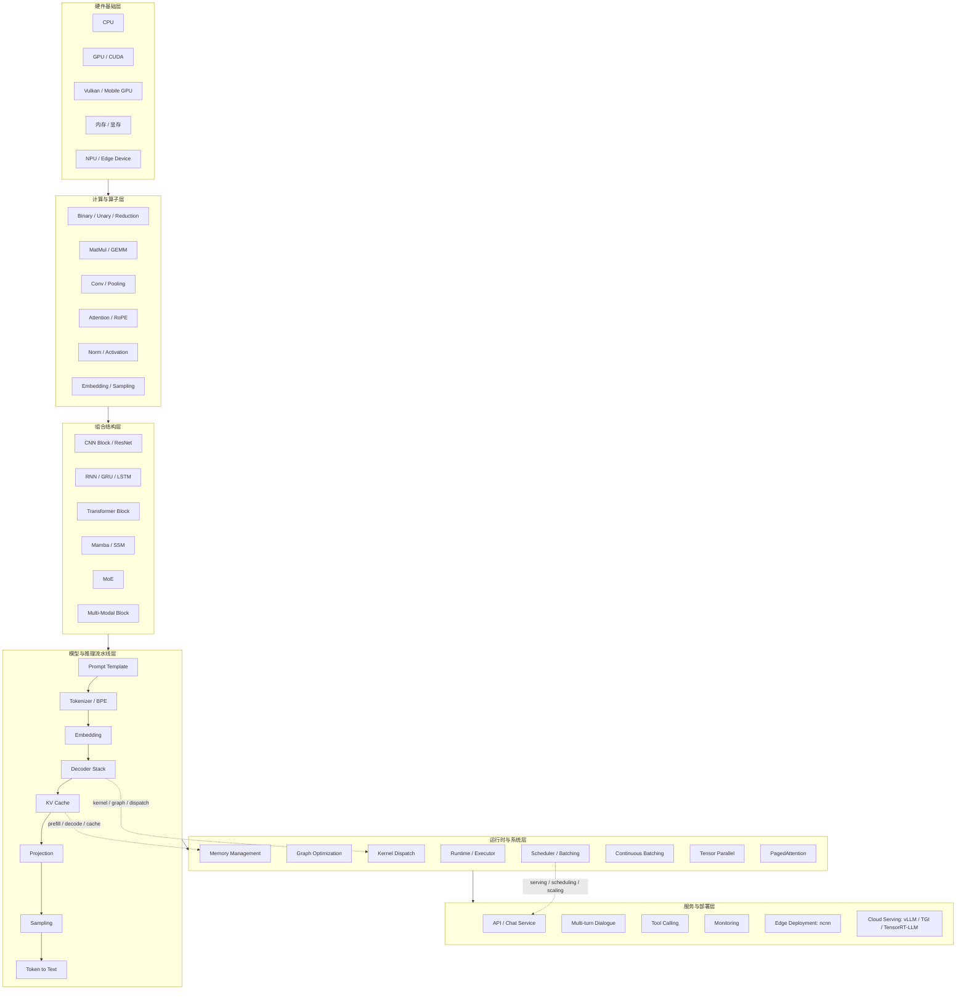

# AI Infra 系统级学习笔记：从深度学习算子到大模型推理系统

> 本项目把原有两份学习资料升级为一套 **AI Infra / LLM Inference / 推理系统工程** 学习项目。  
> 目标不是单纯背概念，而是建立一条完整主线：**算子 → 计算图 → Runtime → KV Cache → Scheduler → Serving → 部署优化**。

---

## 0. 项目定位

这是一套面向以下目标的系统级学习资料：

- 想从深度学习算法转向 **AI Infra / 推理工程 / 大模型部署**；
- 已经了解 CNN、Transformer、LLM 基本结构，但希望理解推理系统为什么快、为什么省显存；
- 想把 `ncnn_llm`、`vLLM`、`TensorRT-LLM`、`TGI` 这类项目串成一条学习主线；
- 想形成可写进简历、可用于面试复盘、可持续更新的 GitHub 学习项目。

原始资料已经具备两个强基础：

1. **算子与架构基础**：包括 Binary/Unary/Reduction、MatMul/GEMM、Conv、Attention、RoPE、Norm、Activation、量化、图优化、部署、模型压缩等；
2. **ncnn_llm 推理链路**：包括 Prompt Template、Tokenizer/BPE、RoPE、Embedding、Decoder、Projection、Sampling、KV Cache、Prefill/Decode、INT8、Vulkan、FlashAttention、Tool Calling、Vision 多模态等。

本项目在此基础上补上 AI Infra 最关键的三条系统主线：

```text
Memory System      : KV Cache、PagedAttention、显存碎片、Cache 复用、KV 量化
Execution System   : Runtime、Graph、Kernel Dispatch、Prefill/Decode、Continuous Batching
Serving System     : Request Queue、Scheduler、Streaming、API、Monitoring、Autoscaling
```

---

## 1. 总体架构



这张图对应本项目的学习方式：先从你已有的 **深度学习算子表** 出发，理解模型是如何计算的；再沿着 `ncnn_llm` 的推理流水线理解 LLM 如何生成；最后补齐服务端推理系统最核心的内存、调度、批处理与部署优化。

---

## 2. 推荐阅读顺序

| 阶段 | 文档 | 目标 |
|---|---|---|
| 0 | [00_overview.md](docs/00_overview.md) | 明确你的当前基础、升级方向和学习地图 |
| 1 | [01_system_architecture.md](docs/01_system_architecture.md) | 建立 AI Infra 六层架构图 |
| 2 | [02_compute_operator_layer.md](docs/02_compute_operator_layer.md) | 把算子理解升级成计算系统理解 |
| 3 | [03_llm_inference_pipeline.md](docs/03_llm_inference_pipeline.md) | 理解 LLM 推理全链路：文本到 token，再到 token |
| 4 | [04_memory_kv_cache.md](docs/04_memory_kv_cache.md) | 深入 KV Cache、显存占用、PagedAttention、KV 量化 |
| 5 | [05_execution_scheduler.md](docs/05_execution_scheduler.md) | 补齐 Scheduler、Batching、Prefill/Decode 调度 |
| 6 | [06_quantization_optimization.md](docs/06_quantization_optimization.md) | 理解 INT8/FP8/INT4、FlashAttention、profiling |
| 7 | [07_ncnn_to_vllm_comparison.md](docs/07_ncnn_to_vllm_comparison.md) | 从 ncnn 端侧推理过渡到 vLLM 服务端推理 |
| 8 | [08_project_and_resume.md](docs/08_project_and_resume.md) | 把学习内容包装成 GitHub 项目、简历项目和面试素材 |
| 9 | [09_learning_plan.md](docs/09_learning_plan.md) | 按 6 周学习计划推进 |
| 10 | [10_glossary.md](docs/10_glossary.md) | 术语速查 |

---

## 3. 项目目录

```text
AI_Infra_System_Notes/
├── README.md
├── CHECKLIST.md
├── docs/
│   ├── 00_overview.md
│   ├── 01_system_architecture.md
│   ├── 02_compute_operator_layer.md
│   ├── 03_llm_inference_pipeline.md
│   ├── 04_memory_kv_cache.md
│   ├── 05_execution_scheduler.md
│   ├── 06_quantization_optimization.md
│   ├── 07_ncnn_to_vllm_comparison.md
│   ├── 08_project_and_resume.md
│   ├── 09_learning_plan.md
│   └── 10_glossary.md
├── diagrams/
│   └── ai_infra_architecture.mmd
├── assets/
│   └── ai_infra_architecture.svg
└── source/
    ├── deep_learning_operators_original.md
    └── ncnn_llm_original_README.md
```

---

## 4. 一句话主线

> **AI Infra 推理系统的本质：把一次模型前向计算，改造成一个能在真实服务中高吞吐、低延迟、低显存、可扩展运行的系统。**

换句话说，算法同学通常关心：

```text
模型结构是否有效？Loss 是否下降？精度是否提升？
```

AI Infra 同学更关心：

```text
这个模型如何被执行？算子如何映射到 kernel？KV Cache 如何存？多个请求如何调度？吞吐和延迟如何平衡？如何部署到端侧或服务端？
```

---

## 5. 你的学习升级路线

```text
当前基础：算子理解
    ↓
已进入：ncnn_llm 推理链路
    ↓
重点补齐：内存系统 / 执行系统 / 调度系统
    ↓
进阶目标：vLLM / TensorRT-LLM / TGI 源码理解
    ↓
最终目标：AI Infra 推理工程师能力模型
```

---

## 6. 学习输出要求

每学完一章，建议都留下三类输出：

1. **一句话解释**：这个模块解决什么问题？
2. **流程图或数据流**：输入是什么、输出是什么、中间状态是什么？
3. **工程问题**：它为什么会影响速度、显存、吞吐、延迟或部署稳定性？

例如 KV Cache 的学习输出应该是：

```text
一句话：KV Cache 通过缓存历史 token 的 K/V，避免 decode 阶段重复计算历史序列。
数据流：new_token -> Q/K/V -> concat past K/V -> attention -> new hidden -> append KV。
工程问题：长上下文下 KV Cache 成为主要显存瓶颈，需要 paging、量化、复用与 eviction。
```

---

## 7. 后续建议深挖项目

| 项目 | 学习重点 | 对应本项目章节 |
|---|---|---|
| ncnn / ncnn_llm | 端侧推理、轻量 runtime、Vulkan、INT8 | 03 / 06 / 07 |
| vLLM | PagedAttention、Continuous Batching、Scheduler | 04 / 05 / 07 |
| TensorRT-LLM | Kernel Fusion、Tensor Parallel、FP8、Plugin | 05 / 06 / 07 |
| TGI | Streaming、Batching、服务化推理 | 05 / 07 |
| ONNX Runtime | Graph Optimization、Execution Provider | 02 / 05 |
| llama.cpp | CPU 推理、量化、内存映射、端侧部署 | 04 / 06 / 07 |

---

## 8. 当前版本说明

本版本主要完成“结构升级”：

- 保留原始两份文档作为资料源；
- 新增 AI Infra 六层架构；
- 新增 Memory / Execution / Serving 三条主线；
- 新增 ncnn → vLLM 的对照学习路径；
- 新增面试、简历和 GitHub 项目包装。

后续可以继续补：

- vLLM 源码阅读笔记；
- PagedAttention 源码级解析；
- TensorRT-LLM plugin / kernel fusion 解析；
- 一个最小 LLM serving demo；
- 端侧 ncnn 与服务端 vLLM 性能对比实验。
